# 🌩️ AWS VPC Setup using Terraform

This repository contains Terraform code (`myfile.tf`) to provision a basic AWS VPC environment and supporting resources on AWS.  
The `IMAGES/` folder has AWS Console screenshots for each major step so you can visually verify the infrastructure.

---

## 🧱 What this configuration creates

Using Terraform, this setup provisions:

- **VPC** with a custom CIDR block
- **Subnets** inside the VPC (for application tiers / isolation)
- **Internet Gateway** attached to the VPC for outbound internet access
- **Route Table** with a default route (`0.0.0.0/0`) pointing to the Internet Gateway
- **Security Group** with inbound/outbound rules for EC2 access (e.g. SSH/HTTP)
- **EC2 Instances** launched inside the created subnets
- Tags on resources so they are easy to identify in the AWS console

This repo is a simple but complete example of **Infrastructure as Code (IaC)** for a small VPC-based environment.

---

## 🧰 Prerequisites

- AWS account with permissions to create:
  - VPC, Subnets, Internet Gateway, Route Tables, Security Groups, EC2
- **Terraform** installed (v1.x recommended)
- AWS credentials configured:
  - `aws configure`, or  
  - environment variables, or  
  - named AWS profile

---

## 🚀 How to use

### 1) Clone the repository

```bash
git clone https://github.com/sanket3122/cloud-task3.git
cd cloud-task3
```

2) Configure AWS credentials
```bash
aws configure
```
Or set the environment variables:
```bash
export AWS_ACCESS_KEY_ID=YOUR_KEY
export AWS_SECRET_ACCESS_KEY=YOUR_SECRET
export AWS_DEFAULT_REGION=YOUR_REGION
```

3) Initialize Terraform

```bash
terraform init
```

4) Preview the plan
```bash
terraform plan
```

5) Apply and create resources
```bash
terraform apply
```

6) Type yes to confirm.

Destroy resources when finished
```bash
terraform destroy
```

6) Files

myfile.tf – Terraform configuration for VPC, networking, and EC2 instances

IMAGES/ – All AWS Console screenshots referenced below

Screenshots (AWS Console Output)

All screenshots are stored in the IMAGES folder.

High-level views (VPC, subnets, routes, security group, instances):

## 📸 Screenshot details

### 1️⃣ 1.PNG – WordPress AMI / application page
Browser page served from the WordPress EC2 instance, confirming that HTTP access to the instance works through the VPC, route table, and security group.
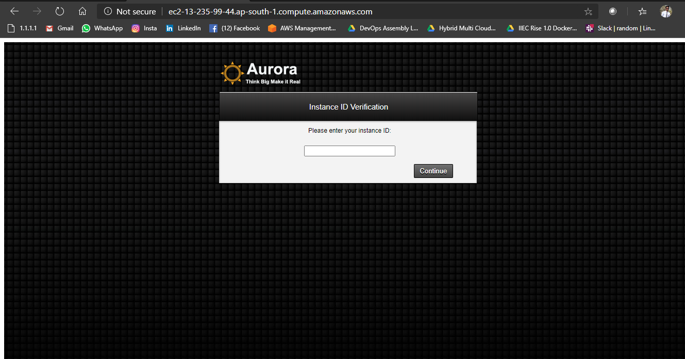

### 2️⃣ 2.PNG – WordPress / Aurora instance setup screen
Another step in the WordPress/Aurora AMI web wizard, used to initialise the stack and prove end-to-end connectivity to the instance.
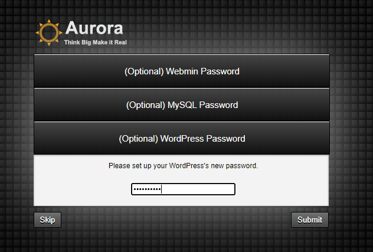

### 3️⃣ 3.PNG – WordPress welcome / blog view
Front-end view of the WordPress site after the stack is up, showing that the web server, PHP and database are all working correctly.
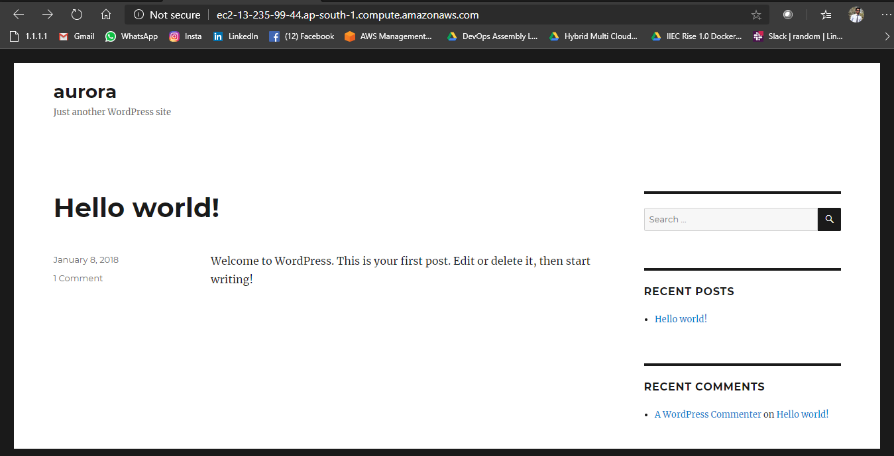

### 4️⃣ 5.PNG – WordPress configuration / post-deployment view
Additional WordPress UI screen captured after deployment, used as evidence that the application is stable and reachable from the internet.
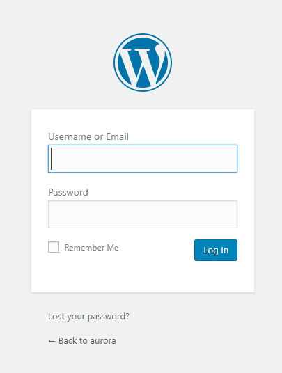

### 5️⃣ 52.PNG – VPC / networking configuration (intermediate console view)
AWS console view taken during creation of the VPC networking components (VPC, subnets, routes, or gateway), used to document the configuration steps.

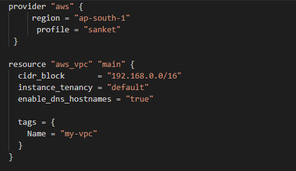

### 6️⃣ 53.PNG – VPC / networking configuration (intermediate console view)
Another AWS networking console screen recorded while wiring up the VPC, helping verify CIDR ranges, associations and overall topology.
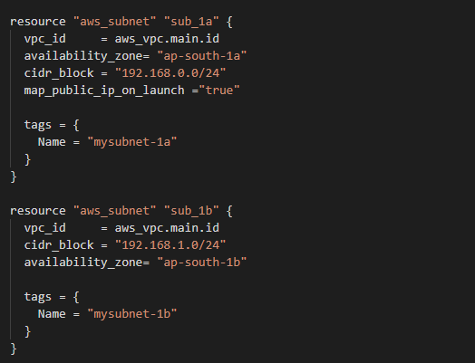

### 7️⃣ 54.PNG – VPC / networking configuration (intermediate console view)
Screenshot captured while validating additional VPC-level settings (such as route associations or Internet Gateway attachment).
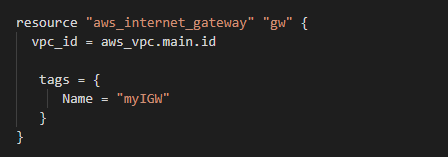

### 8️⃣ 55.PNG – VPC / networking configuration (intermediate console view)
Screenshot showing one more networking page from the setup flow, used to prove that all required resources were created and linked correctly.

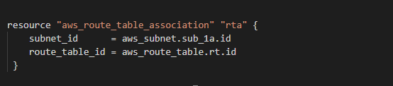

### 9️⃣ 56.PNG – WordPress access validation
Browser view hitting the public endpoint of the WordPress instance, confirming that DNS/public IP, routing and security group rules are correct.

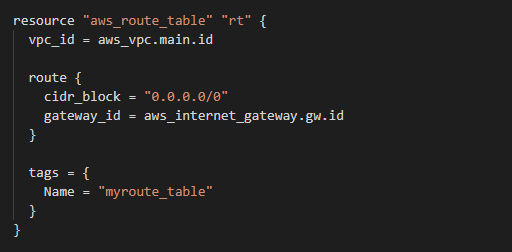

### 🔟 57.PNG – WordPress / Aurora password or instance verification
Application screen where credentials or instance information are provided, demonstrating that the instance is responding and the bootstrap wizard runs successfully.

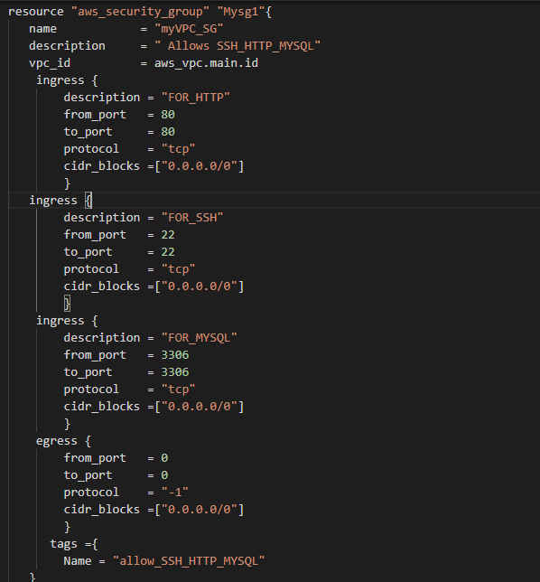

### 1️⃣1️⃣ 58.PNG – Final WordPress “Hello world!” page
Public WordPress blog home page, confirming that content can be served over HTTP from the EC2 instance inside the custom VPC.
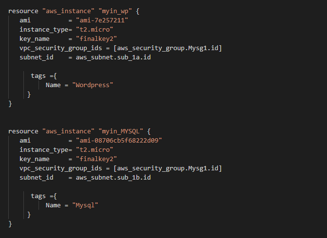

### 1️⃣2️⃣ 6.PNG – Additional WordPress runtime screen
Extra application screenshot kept as proof that the WordPress stack remains reachable and functional after setup.
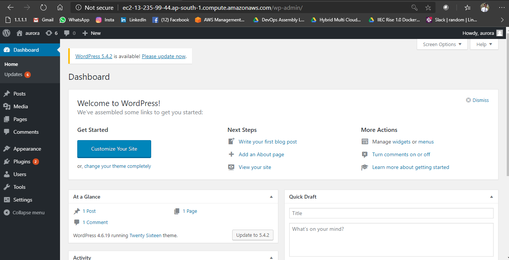

### 1️⃣3️⃣ gateway.PNG – Internet Gateway attached to VPC
AWS VPC console page showing the Internet Gateway resource that provides outbound internet access for the public subnets.
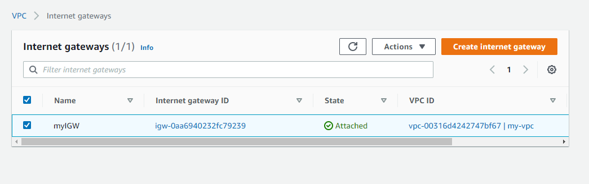

### 1️⃣4️⃣ instances.PNG – EC2 instances for WordPress & MySQL
EC2 console listing the two instances (Wordpress and Mysql) running in different Availability Zones, both in running state and using the VPC security group.
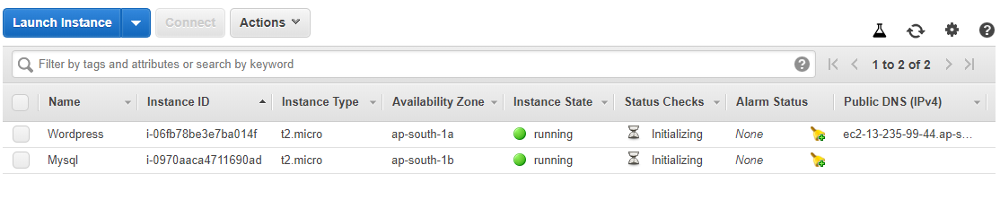

### 1️⃣5️⃣ route-table.PNG – Custom route table
Route tables page showing the custom route table (e.g. myroute_table) associated with the public subnet and including the default route 0.0.0.0/0 to the Internet Gateway.
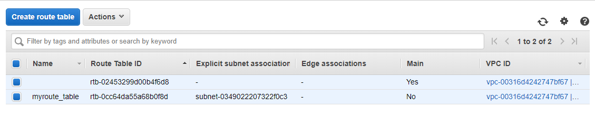

### 1️⃣6️⃣ security-grp.PNG – Security group rules
Security group detail view summarizing inbound rules (SSH, HTTP, MySQL) and outbound rules that control traffic to the EC2 instances.
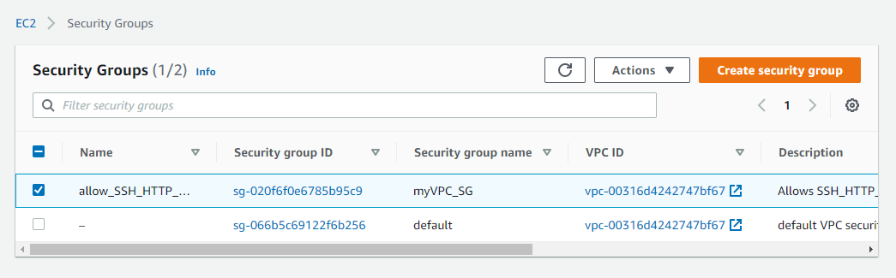

### 1️⃣7️⃣ subnets.PNG – Public subnets in the VPC
Subnets page listing the subnets created inside the custom VPC, with their CIDR blocks and Availability Zones.
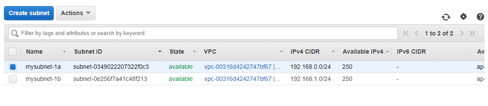

### 1️⃣8️⃣ vpc.PNG – Custom VPC overview
VPC console showing the custom VPC my-vpc with CIDR 192.168.0.0/16 (or similar), in available state, confirming that the base network was created successfully.
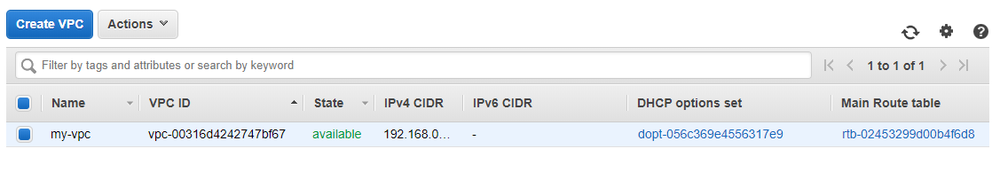


## Thank you!!!

